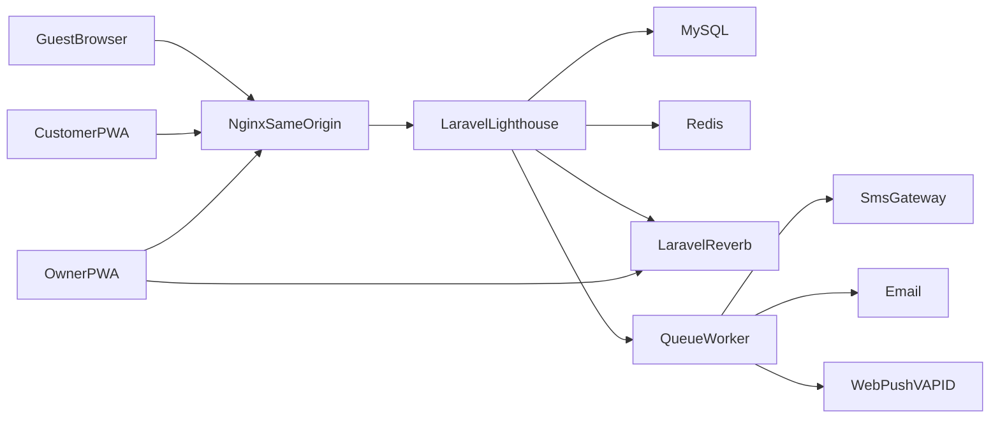

# System context

## Actors

- **Guest** — discovery, salon profile, busy-level. No cookie required except the optional QR hold cookie.
- **Customer** — registered user (email+password). May also be an owner.
- **Owner** — same `users` table; access via owning at least one salon (invite-only onboarding).
- **Worker** — salon row only. No login at MVP.

## Trust boundary

The PWA and GraphQL share one origin. Sanctum session cookie is not readable by JS. Guest queries stay public. Mutations that create bookings require verified email and verified phone. Owner mutations require verified email plus salon policy.

## External systems (interfaces, not vendors)

- **SmsGateway** — OTP and status SMS fallback. Local: log/fake driver. Staging: real BiH-capable vendor later.
- **Mail** — verification, reminders. Local: Mailpit. Staging: SMTP.
- **Web Push** — VAPID keys, service worker. Payload includes `salonId` because one user may own several salons.
- **Maps** — no SDK. Discovery is a geo-sorted list. Salon profile may link out to Google Maps.
