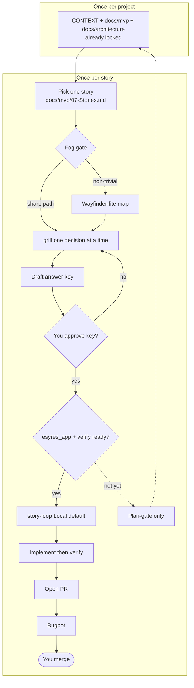

# Esyres lifecycle

How a story moves from pick → approved answer key → one PR. Product and architecture are already locked; the once-per-project group is the entry, not a re-scaffold.

Use this diagram in decks (screenshot Mermaid) or keep it as the editable source of truth.

## Reading the main path

1. **Once per project:** already done. CONTEXT, `docs/mvp/`, and `docs/architecture/` are locked. Do not re-run `/scaffold-project`.
2. **Once per story:** pick one story from `docs/mvp/07-Stories.md`. Clear fog (optional map) and grill open decisions (**grill-with-docs** now that `esyres_app/` has code).
3. When fog and opens are empty, the agent drafts the answer key in the same turn. There is no separate “OK to compile.”
4. You approve the key. Every product check must name a verifier (test, command, or `human-only: …`; cap human-only at 1–2).
5. When `esyres_app/` has a real verify runner: story-loop (Local default; Cloud on `unattended`) → PR → Bugbot → you merge. Trivial Bugbot nits stay on the same PR; findings that contradict the key stop and wait for you.

## Dashed branch

`esyres_app/` has a slim Compose verify runner. Coding loops are unblocked. Plan-gate only when fog remains or the key is unapproved.
