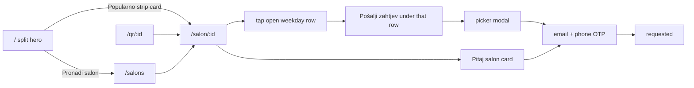
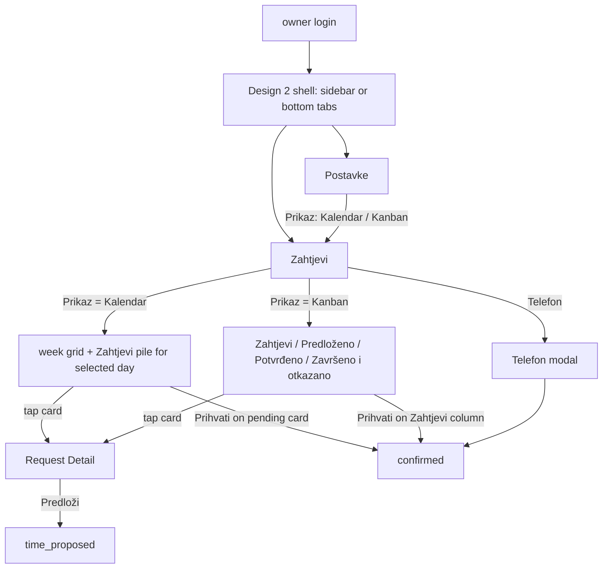

# Streamlined task flows — September 2026 (Design 2)

Not product truth. Companion to [`ux-audit-2026-09.md`](ux-audit-2026-09.md) and [`refs/design-2/wireframes.md`](../../refs/design-2/wireframes.md).

## Guest: find a salon and send a request (unchanged contract)

Change vs today: the homepage adds a second, shorter door (Popularno strip → salon) and a visible owner door (Za salone card → `/create-salon` or `/owner`). Steps after the salon profile are untouched.

## Owner: land, triage, confirm

Taps saved:

- Nav: one sidebar (md+) or one bottom tab bar (phone) instead of TopNav + aside + repeated OwnerNav.
- Week at a glance: Kalendar shows seven days of occupying cards in one view; no day-by-day tapping.
- Pipeline: Kanban shows counts per status column for the selected day.

## Owner: Zapisi

- Kalendar: the selected day as a time-ordered timeline of pastel status cards (origin chip filters stay).
- Kanban: the same day grouped in the four status columns.
- Tap any card → Request Detail (Nazad returns to Zapisi, as today).

## Owner: switch view

Postavke → **Prikaz** segmented toggle (Kalendar | Kanban) → saves immediately to the account (`updateOwnerView`) → Zahtjevi and Zapisi render that template on every device.
